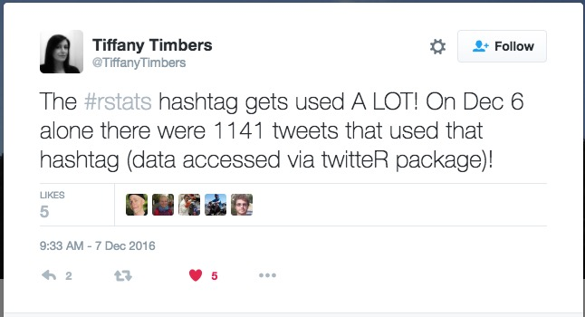
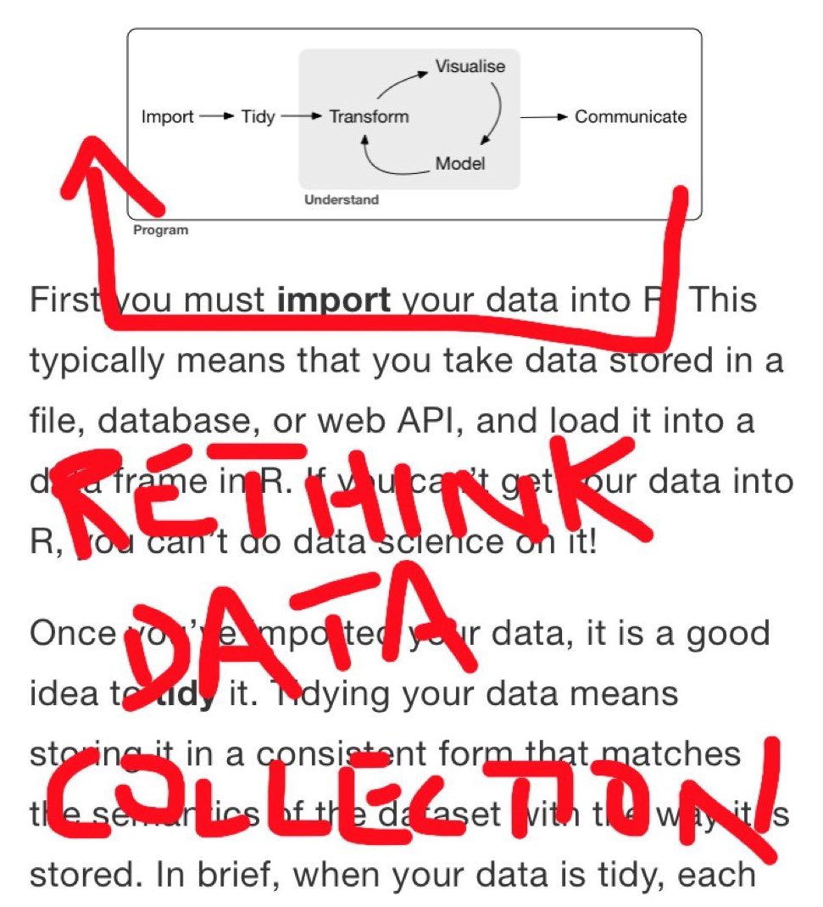
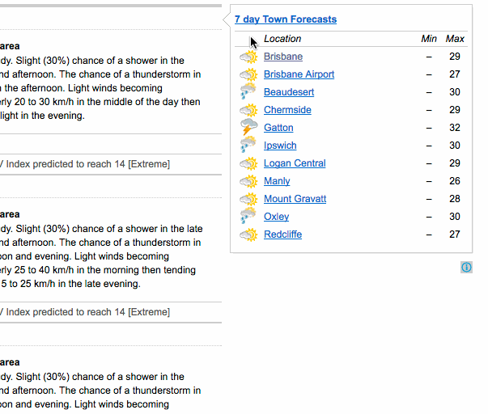
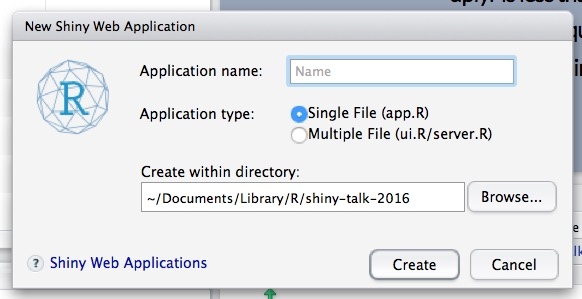
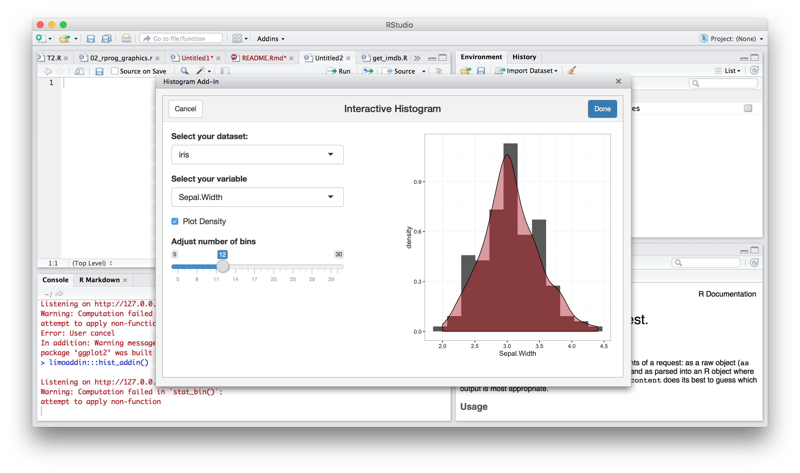

Rise and Shiny
======================
John David Smith
- I'm a **totally** novice Shiny user
- The name **Shiny** always sounded bit frivolous
- But now I'm convinced that it's an everyday tool
- Using it every day different from creating Shiny apps
- I have one minimum (barely) viable example
 https://github.com/smithjd/shiny16

Shiny Dawns On Me
===================
- R is **all** about (reproducibly) touching and fiddling with your data to think about it
- Conway talk: letting the bosses fiddle to verify data and algorithm
- Hadley's talk at Reed College where a model's residuals point to war and famine in Africa
- Roger Peng podcast remark that his students **start** exploration using Shiny (although he doesn't)
- Cost of R: it's a (raplidy) moving target
 + dplyr is less than 2 years old but I'm **always** using it now
 + Effort to think of Shiny as an ordinary, everyday tool

Keeping up with R is a daily task
========

Using ONE tool for the entire process
==============

(Thanks, Winston and Hadley!)

My pitch
========================================================
Talk about some very different use cases for Shiny
- Communicating complex issues to the public
- Making everyday R activities more interactive
- Informal exploratory analysis

1. To Communicate (with an Audience)
========================================================
 Examples:
- Minnier et al.: https://kcvi.shinyapps.io/START/
- Population Genetic Simulations: https://cjbattey.shinyapps.io/driftR/
- How to share your Shiny app: http://blog.revolutionanalytics.com/2015/02/sharing-your-shiny-apps-1.html
- Many, many goodies out there

2. Data acquision
========================================================
- OCR an image and get a word cloud: http://5.100.228.219:3838/sample-apps/OCRimage/
- Point and click to select colums from a data frame: https://edwinth.github.io/blog/column-selecter/
+ **datapasta** - Keyboard shortcuts to paste clipboard data as nice vectors/tibbles.

Data pasta: Making Casual Data Grabbing easier
==============

3. Use Gadgets and Addins
============
- Shiny gadgets: http://shiny.rstudio.com/articles/gadgets.html
- Rstudio add-ins: https://github.com/daattali/addinslist
+ **colorpickr** - Lets you easily select colours
+ **ggThemeAssist** - Customize your ggplot theme
+ **tidyshiny** - Interactively build tidyr function call (gather)
+ **addinslist** - (Naturally) a way to browse and instal AddIns
+ **copydat** - Copy a data.frame to the clipboard

Exploration should be as easy as...
========

- Cheat sheet: https://www.rstudio.com/wp-content/uploads/2016/01/shiny-cheatsheet.pdf

An add-in that produces R code!
=================
(Discovered **limoaddin** at 3:17 pm today)

 ggplot(data = re_expressed, aes(x = to_plot)) +
geom_histogram(aes(y = ..density..), bins = 30) +
theme_bw()

Exploratory analysis should always include
================
at a minimum...
- Looking at distributions (histograms)
- Considering re-expression (taking logs or roots)

But doing it with Shiny is **not** so easy...

(and my attempts are out there but I won't show them tonight!)

